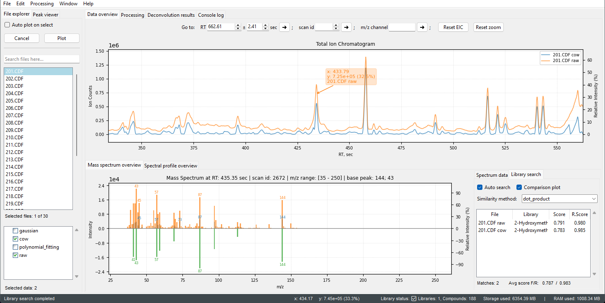

<!--  -->
<link rel="stylesheet" href="style.css">

<!-- Hero Banner -->

  

  

  

    <h1 style="font-size: 5.0em; margin: 0; font-weight: bold; color: white">Pyromics</h1>
    
Transforming Py-GC-MS data into meaningful biological results

   <a href="https://github.com/CreMoProduction/pyromics/releases/latest" style="
      display: inline-block;
      padding: 12px 32px;
      background-color: #007bff;
      color: white;
      text-decoration: none;
      border-radius: 4px;
      font-size: 1.1em;
      font-weight: bold;
      transition: background-color 0.3s ease;
   " onmouseover="this.style.backgroundColor='#0056b3'" onmouseout="this.style.backgroundColor='#007bff'">
      Download Pyromics for Windows x64
   </a>

   

      <h3 style="color: #455a64; margin-top:0;">Automatic Data Processing</h3>
      

         Streamline your workflow with fully automated batch processing of Py-GC-MS data.
      

   

   

      <h3 style="color: #455a64; margin-top:0;">Fast, Multithreaded Processing</h3>
      

         Take advantage of high-speed, multithreaded analysis optimized for rapid batch processing.
      

   

   

      <h3 style="color: #455a64; margin-top:0;">Free to Use</h3>
      

      Pyromics is free and accessible for researchers.
         <a href="#/license.md" style="color: #007bff; text-decoration: none; font-weight: 500;"> Learn more</a>
      

   

   

      <h3 style="color: #455a64; margin-top:0;">User-Friendly GUI</h3>
      

         No coding or command line required - designed for non-experts with an intuitive graphical interface.
      

   

   

      <h3 style="color: #455a64; margin-top:0;">Lignin & Carbohydrates Classification</h3>
      

         Specialized for the classification of lignin and carbohydrates.
      

   

   

      <h3 style="color: #455a64; margin-top:0;">Advanced Fine-Tuning</h3>
      

         Detailed step-by-step workflow with advanced fine-tuning and visual monitoring at every stage.
      

   

 

   <a href="#/quick_start.md" style="
      display: inline-block;
      padding: 12px 32px;
      background-color: #008d28;
      color: white;
      text-decoration: none;
      border-radius: 4px;
      font-size: 1.1em;
      font-weight: bold;
      transition: background-color 0.3s ease;
   " onmouseover="this.style.backgroundColor='#00ad31'" onmouseout="this.style.backgroundColor='#008d28'">
      Get started quickly - visit the Quick Start page
   </a>

     
   

 

________________________________________

# Pyromics: Speed and Efficiency
Transform your Py-GC/MS workflow with Pyromics, the ultimate solution for rapid and sustainable material analysis by the resolution of complex, overlapped peaks through both automated and user-controlled processes. Pyromics allows you to shrink your GC run times from a traditional 40–60 minutes down to just 15 minutes. This acceleration not only boosts your laboratory’s throughput but also significantly reduces the need for frequent spare parts. It makes your operations more sustainable and cost-effective. With our advanced data processing engine Pyromics delivers the results in under 5 minutes. Pyromics empowers you to spend less time on instrument maintenance and more time unlocking critical analytical insights.

# The User-controlled Analytical Workflow
Designed for both experts and non-experts. At each stage—including [denoising](denoising.md), [baseline correction](baseline_correction.md), [sample alignment](sample_alignment.md), [deconvolution](deconvolution.md), and [annotation](annotation.md) maintain complete control. This design allows for detailed monitoring, where users can visually assess the quality and integrity of the data with "before" and "after" views of their chromatograms.
To support diverse research questions and data types, the application offers multiple algorithms for every processing step. Optimal settings for any method can be easily saved, which further streamlines future analyses.

________________________________________
# ✅ Key Benefits:

<strong>
Pyromics provides the following distinct advantages for data processing:
</strong>

- **Lignin & Carbohydrates classification**: Identifies and separates lignin- and carbohydrate-related compounds.
- **Fast Processing & Multithreading**: Delivers rapid analysis using multithreaded algorithms, fully utilizing available hardware resources.
- **User-Friendly GUI**: Intuitive graphical interface designed for ease of use, requiring no coding or command line experience.
- **Accessible for All Users**: Equally suitable for non-experts and for users who require detailed quality control and advanced processing.
- **Flexible Chromatogram Segmentation**: Uses automatic and user-adjustable peak picking for chromatogram-to-window segmentation.
- **Comprehensive Compound Annotation**: Annotates compounds using the entire spectrum, not just class ion fragments, for improved accuracy.
- **Detailed Output Reporting**: Generates results as class and subclass percentage quantities within samples, alongside absolute peak area values.
- **Custom Library Support**: Allows use of sample-specific or custom compound libraries.

________________________________________

> **Note:** If you use Pyromics in your research, please remember to cite the appropriate reference
> 
>  
> Your citation helps support the development and acknowledges the work behind Pyromics!

  
<strong>Get started quickly - visit the <a href="#/quick_start.md">Quick Start</a> page</strong>

