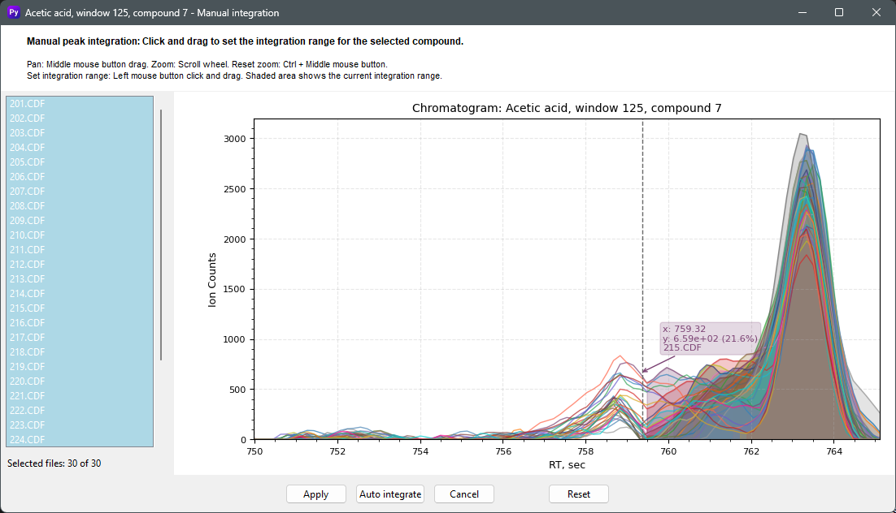

<link rel="stylesheet" href="style.css">

# Manual peak integration

     
    

You can manually reintegrate peak area for resolved compounds in the Deconvolution Results Tab by right-clicking on the selected compound. This feature allows you to adjust peak boundaries and recalculate areas for individual components when automatic deconvolution results need refinement. The manual integration tool provides precise control over peak region selection to ensure accurate quantification of overlapping or poorly resolved peaks.

