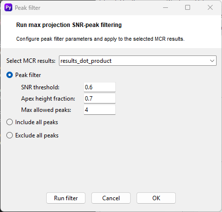
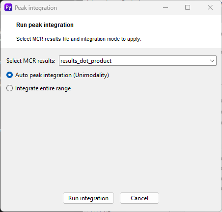

<link rel="stylesheet" href="style.css">

# Peak filtering and integration

After peak deconvolution, the resulting profiles  require refinement to ensure only biologically relevant signals are carried forward for quantification. Peak filtering utilizes Signal-to-Noise Ratio (SNR) and shape constraints to prune artifacts, while integration converts these resolved profiles into quantitative peak areas. This is done by default witihin the main processing, but can be run seprately after the processing to achieve the best resutls. TO disable auto peakk filtering and integration diisable it in the [Peak deconvolution MCR-ALS settings](deconvolution.md). 
 

## Peak Filtering Settings
The Peak filter window allows for the automated selection of high-quality chromatographic peaks based on their signal properties relative to the baseline and their morphology.

     
    

### Usage
- **Select MCR results**: Choose the specific MCR output object (e.g., results_dot_product) to which the filter will be applied.
- **SNR threshold**: Sets the minimum Signal-to-Noise Ratio required for a peak to be retained. This helps eliminate low-intensity baseline noise.
- **Apex height fraction**: Defines the height relative to the apex used for determining peak boundaries or evaluating peak shape stability.
- **Max allowed peaks**: Constraints the maximum number of peaks to be identified within a specific elution window, preventing the inclusion of excessive noise spikes or minor artifacts.
#### Global Options
- **Include all peaks**: Bypasses filtering to keep all resolved components.
- **Exclude all peaks**: Removes all components from the current selection.

## Peak Area intgration Settings
TOnce peaks are filtered, the Peak integration step calculates the area under the curve for the resolved elution profiles, which is essential for downstream statistical analysis and metabolite quantification.

     
    

### Usage

- **Auto peak integration (Unimodality)**: This advanced mode uses a unimodality constraint to automatically identify the start and end points of a peak. It ensures that the integration is focused on a single, continuous chromatographic feature, minimizing the influence of neighboring signals or baseline drift.
- **Integrate entire range**: Calculates the area across the full duration of the resolved profile. This is useful when the MCR component is already well-isolated and represents a single elution event.

Click **Run integration** to process the data, or **Cancel** to abort.